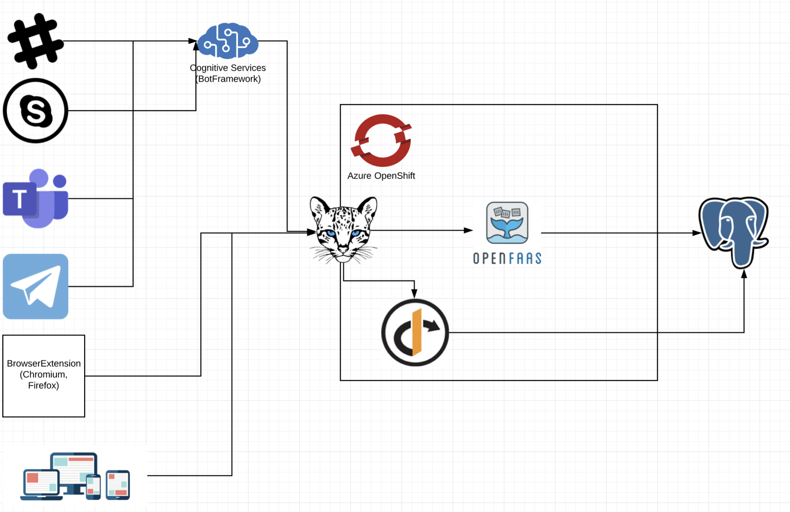

# Architecture

## Diagram

## OpenFaas

Serverless Functions

Made Simple. OpenFaaS® makes it simple to deploy both functions and existing code to Kubernetes

[https://www.openfaas.com/](https://www.openfaas.com/)

## OKD

The Community Distribution of Kubernetes that powers Red Hat OpenShift.

Built around a core of OCI container packaging and Kubernetes container cluster management, OKD is also augmented by application lifecycle management functionality and DevOps tooling. OKD provides a complete open source container application platform.

[https://www.okd.io/](https://www.okd.io/)

## Ocelot

Open Source .NET Core API Gateway

A modern fast, scalable API gateway built on asp.net core

[https://threemammals.com/ocelot](https://threemammals.com/ocelot)

## IdentityServer4

IdentityServer4 is an OpenID Connect and OAuth 2.0 framework for ASP.NET Core.

[https://identityserver4.readthedocs.io/en/latest/](https://identityserver4.readthedocs.io/en/latest/)

## Bolero

Bolero: F# in WebAssembly
Develop SPAs with the full power of F# and .NET.

[https://fsbolero.io/](https://fsbolero.io/)

## BotFramework

Microsoft Bot Framework

A comprehensive framework for building enterprise-grade conversational AI experiences.

[https://dev.botframework.com/](https://dev.botframework.com/)

## Vuejs

The Progressive
JavaScript Framework

[https://vuejs.org/](https://vuejs.org/)

## PostgreSQL

The World's Most Advanced Open Source Relational Database

[https://www.postgresql.org/](https://www.postgresql.org/)
