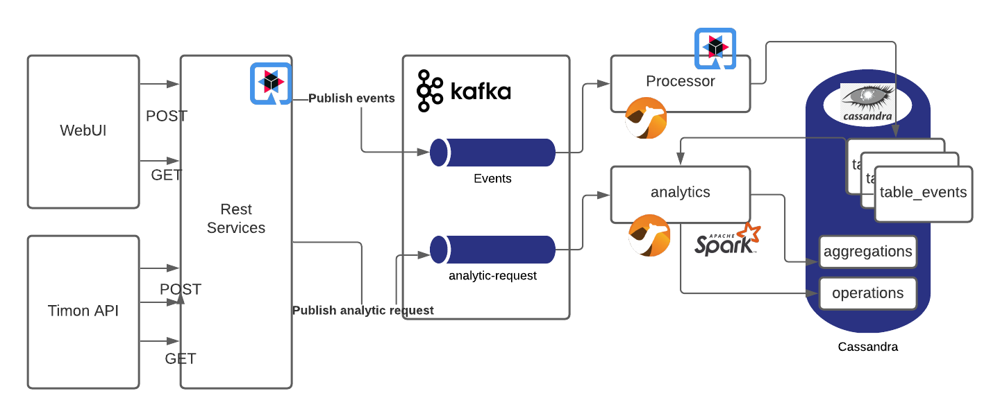

# Architecture

## Diagram

## WebUI & Timon API
WebUI implemented on vue.js to push events and visualize events, trends and predictions. It's an independent tool for data analysis

TimonAPI push events and get trends and predictions

## Rest Services
API to interact with the Data Analysis system, made in quarkus and quarkus cassandra extension

## Processor 

Data processing services. Includes consumer groups to retrieve events from Kafka and store into Cassandra tables, Implementation with Quarkus and Apache Camel

## Analytics
Data analytics services. 
Aggregates events, forecast values for aggregated values 
Predictions.
Implemented with Spark and Apache Camel. Processing with Python Data Analysis libraries.

## Kafka implementation

Event store in CQRS architecture

## Cassandra

Database for events, aggregations, predictions, +

# Software

## Quarkus

Reactive applications engine. 
Choosen because the high integration with Kafka and Cassandra

[https://quarkus.io/](https://quarkus.io/)

## Camel

At the core of the Camel framework is a routing-engine builder. It allows  to define routing rules, decide from which sources to accept messages, and determine how to process and send those messages to other destinations. Camel uses an integration language that allows you to define complex routing rules, akin to business processes. application platform.

[https://camel.apache.org/](https://camel.apache.org/)

## Kafka

afka is a distributed system consisting of servers and clients that communicate via a high-performance TCP network protocol. It can be deployed on bare-metal hardware, virtual machines, and containers in on-premise as well as cloud environments.

[https://kafka.apache.org/](https://kafka.apache.org)

## Cassandra

Apache Cassandra is an open source, distributed, NoSQL database. It presents a partitioned wide column storage model with eventually consistent semantics.

[https://cassandra.apache.org/](https://cassandra.apache.org/)

## Spark

Apache Spark is a unified analytics engine for large-scale data processing. It provides high-level APIs in Java, Scala, Python and R, and an optimized engine that supports general execution graphs. It also supports a rich set of higher-level tools including Spark SQL for SQL and structured data processing, MLlib for machine learning, GraphX for graph processing, and Structured Streaming for incremental computation and stream processing.

[https://spark.apache.org/](https://spark.apache.org/)

## Vuejs

The Progressive
JavaScript Framework

[https://vuejs.org/](https://vuejs.org/)

